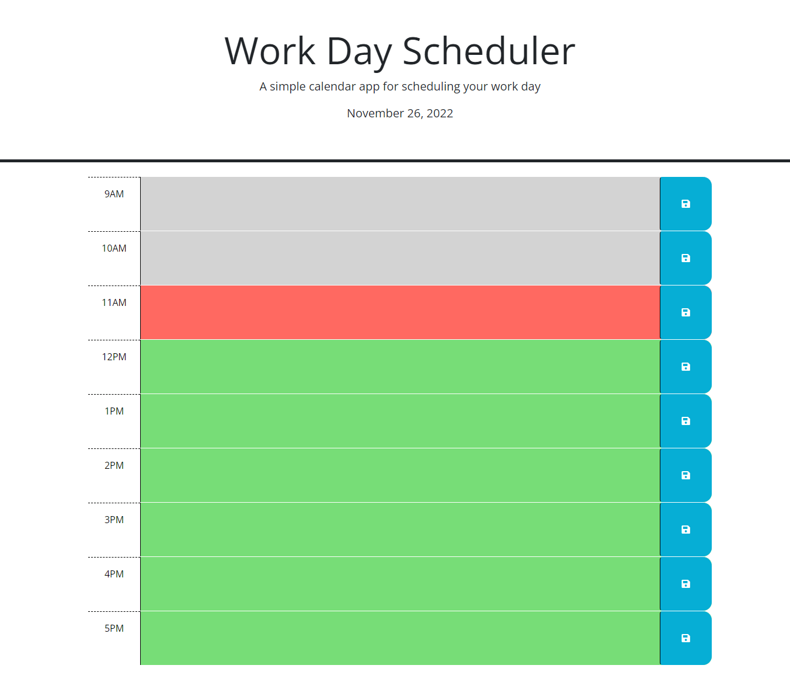

# WORK DAY SCHEDULER

# Link

XXXXXXXXXXXXXXXXXXXXXXXXXXXXXXXX

# Purpose

This application was created to allow users to schedule events during the work day.  They would see the time displayed in the header and also know if the event was past, present, or future based on the color of each time block.  Events are saved to the user's local storage and so will reappear  after the page is refreshed. 

# My Experience

The assignment involved fishing existing code using jQuery.  I needed to refer often to the documentation for jQuery as the syntax is new to me.  I am still refining my knowledge of click events and this was good practice.

# Screenshot

# Credits

Created by William George Thomas, 2022